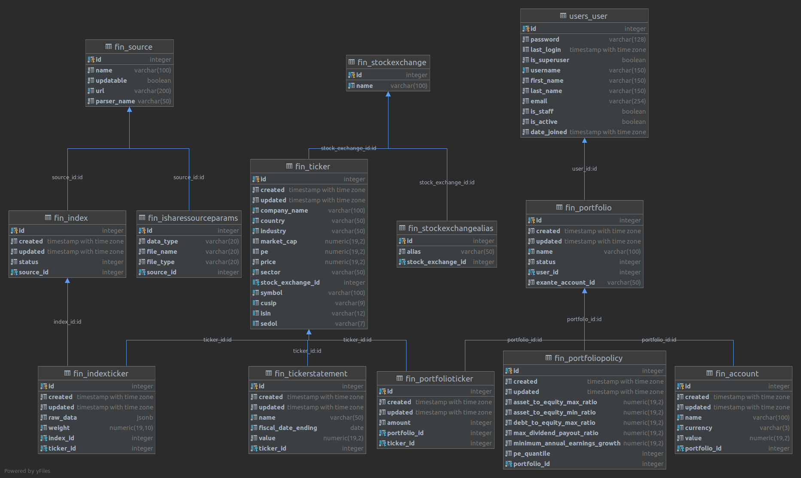

# PA

The application that should help with routine and complex tasks.

### Prerequisites

List of what you need to run the application:

* docker-compose 1.25.3
* docker 19.03.6

### Installing

1. Create copy from every .env distributive without .dist
2. Fill them
3. Run `docker-compose up --remove-orphans`

## FIN

### Description

This is a module of the system that responses for tracking the financial information

Key features:

1. Managing your money accounts (with convenient grouping)
2. Collecting information about cash flow between account through time
3. Enabling supporting of FF API (with convenient grouping)
4. Tracking shares weight in different stock market indices
5. Analyse investment portfolio (MDP, SimplyWallSt)
6. Adjusting the stock market index by the possible amount of money

### ER-diagram



### Before release

Inside the docker django container:

```bash
pylint --rcfile=./.pylintrc fin/* pa/* users/*
pytest --cov-report html --cov=./
```

### DB Dump

```bash
docker exec -t db pg_dump pa -U pa_user > dump_`date +%d-%m-%Y"_"%H_%M_%S`.sql
```

### DB Restore

```bash
cat your_dump.sql | docker exec -i db psql -U pa_user
```